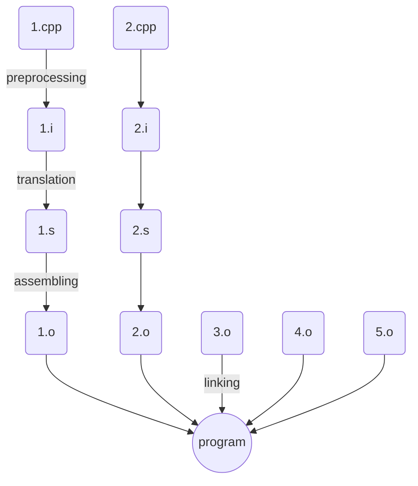

# Процесс компиляции программ

Исторически именно такая схема. На практике бывают "отхождения" - пропуски этапов (слияние в один этап)
**Preprocessing**
`g++ -E -P 1.cpp -o 1.i`
В 1.cpp `#include<stdio.h> --> typedef из stdio.h` а в конце `main`
**Translation**
`g++ -S -masm=intel 1.i -o 1.s`
**Assembling**
`g++ -C 1.s -o 1.o`
тут уже понадобится открыть бинарный файл: `xdd 1.o | less`
**Linking**
`g++ 1.o -o program`
После этого этапа запуск `./program` выведет Hello world!, например(если об этом программа)

По своей сути g++ - драйвер, который запускает этапы компиляции в нужном порядке и удаляет побочные файлы, конечно.

Примеры отхождений:
* _preprocessing_ и _translation_ делает одна прога. Иногда в эту стадию включается assembling(clang)
* 1.o не всегда машинный код, только на linking он в него переходит

Пример линкования файликов:
```c++
a.cpp:							b.cpp:
int main() {					#include<cstdio>
	f();						void f() {prinf("Hell is here");}
}
```
Это не скомпилится, тк на этапе до линковки компилятор не знает о существовании `f()` где то вне a.cpp, поэтому ее надо объявить:
```c++
a.cpp:							b.cpp:
void f();
int main() {					#include<cstdio>
	f();						void f() {prinf("Hell is here");}
}
```
Для линковки вместе:
`g++ a.o b.o`
Если в обеих прогах есть main, то невозможно будет слинковать (какой main запускать?)
### Headers
`2.h` - файлы не участвующие в компиляции, в них пишут объявления ф-ий. Нельзя `#include .cpp`, а в .h нельзя определять ф-ии
(тут надо как то получше, у меня слишком сумбурные записи только)
### Некоторые ключевые слова
Иногда возникает проблема: при 1.i -> 1.s компилятор не знает тела ф-ии и не может с оптимизировать код.
```c++
1.h:
inline void f() {} // - может инлайнить, а может и нет
```
**`inline`** значит что попадет и в a.cpp и в b.cpp -> линковщик не будет ругаться, т.к. особый ключ `inline` - говорит компилятору: все копии одинаковые, оставь одну из них.

**`static`** - ф-я локальна для единицы трансляции 

**`extern int a`** - переменная где-то (объявление)

**`static a`** - локальная в ед.т.

**`int a`** - определение переменной


> Written with [StackEdit](https://stackedit.io/).
